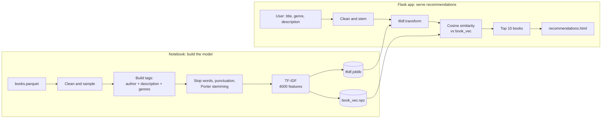

# 📚 Book Recommender System (Content-Based)

[](https://www.python.org/)
[](https://flask.palletsprojects.com/)
[](https://scikit-learn.org/)
[](https://www.nltk.org/)
[](https://pandas.pydata.org/)
[](https://opensource.org/licenses/MIT)

A **content-based book recommendation web app**. You describe the kind of book you like (genres and a short description), and the system returns the **10 most similar books** using **TF-IDF vectors and cosine similarity**. The model is built in a Jupyter Notebook and served through a **Flask** web interface.

---

## 📑 Table of Contents

- [Project Overview](#-project-overview)
- [Key Features](#-key-features)
- [How It Works](#-how-it-works)
- [Tech Stack](#-tech-stack)
- [Repository Structure](#-repository-structure)
- [Dataset](#-dataset)
- [Notebook Walkthrough](#-notebook-walkthrough)
- [Web App](#-web-app)
- [Example Output](#-example-output)
- [Installation](#-installation)
- [Usage](#-usage)
- [Known Limitations](#-known-limitations)
- [Future Improvements](#-future-improvements)
- [License](#-license)
- [Author](#-author)

---

## 📌 Project Overview

Content-based recommenders suggest items that are *similar in content* to what a user likes, with no need for other users' rating history. Here, each book is represented by its **author, description and genres**, converted into a numeric vector with **TF-IDF**. A user's input is converted to the same vector space, and the closest books by **cosine similarity** are returned along with their cover images.

---

## ✨ Key Features

- **Content-based recommendations** from genres and free-text descriptions
- **Text pipeline**: lowercasing, stop-word removal, punctuation cleaning, Porter stemming
- **TF-IDF vectorization** with a 4,000-term vocabulary
- **Compact saved artifacts**: the fitted vectorizer (`tfidf.joblib`) and book vectors (`book_vec.npz`, compressed float16) are loaded directly by the app, so nothing is re-trained at startup
- **Clean Flask UI** with a search form and a card grid of recommended books with covers
- **Exploratory analysis** of ratings, liked percentage, formats, prices, awards and languages in the notebook

---

## 🔄 How It Works



### Step by step

1. **Feature text ("tags")** is created for every book as `author + description + genres`.
2. **Preprocessing:** genres and authors have spaces removed so multi-word names stay one token (for example `Science Fiction` becomes `sciencefiction`); descriptions have English stop words removed; all text is lowercased with punctuation removed.
3. **Stemming:** every word is reduced to its stem with NLTK's `PorterStemmer`.
4. **Vectorization:** `TfidfVectorizer(max_features=4000, stop_words='english')` produces a `9,618 x 4,000` matrix (stored as float16).
5. **Query time:** the user's genres and description go through the same cleaning and stemming, are transformed by the saved vectorizer, and are compared with every book vector using `cosine_similarity`.
6. **Result:** the 10 highest-scoring books are looked up in `books_modified.parquet` and shown with title, author and cover.

---

## 🛠 Tech Stack

| Area | Tools |
|---|---|
| Language | Python |
| Web framework | Flask (Gunicorn listed for deployment) |
| Data handling | pandas, NumPy, Parquet (PyArrow) |
| NLP | NLTK (stop words, Porter stemmer) |
| ML | scikit-learn (`TfidfVectorizer`, `cosine_similarity`) |
| Model persistence | joblib, NumPy compressed `.npz` |
| Frontend | HTML and CSS (Jinja2 templates) |
| Analysis | Jupyter, matplotlib, seaborn |

---

## 📂 Repository Structure

```
Book-Recommender-System--content-based-/
│
├── app.py                          # Flask application (routes and recommendation logic)
├── book recommender system.ipynb   # EDA, preprocessing, TF-IDF model building
├── tfidf.joblib                    # Fitted TF-IDF vectorizer
├── book_vec.npz                    # Pre-computed book vectors (9,618 x 4,000, float16)
├── books_modified.parquet          # Lookup table: title, author, coverImg (9,618 books)
├── books.parquet                   # Original dataset (25,000 books x 25 columns)
├── books..parquet                  # Another copy of the dataset (26,239 rows), not used by the code
├── requirements.txt                # Python dependencies
├── templates/
│   ├── index.html                  # Search form
│   └── recommendations.html        # Results grid
└── README.md
```

---

## 📊 Dataset

`books.parquet` contains **25,000 books with 25 columns**:

| Group | Columns |
|---|---|
| Identity | `bookId`, `title`, `series`, `author`, `isbn` |
| Content | `description`, `genres`, `characters`, `setting`, `awards` |
| Publication | `language`, `bookFormat`, `edition`, `pages`, `publisher`, `publishDate`, `firstPublishDate` |
| Popularity | `rating`, `numRatings`, `ratingsByStars`, `likedPercent`, `bbeScore`, `bbeVotes` |
| Other | `price`, `coverImg` |

The columns match the public Goodreads "Best Books Ever" dataset. Check the original source and its license before reuse.

### Data used for the model

| Stage | Books |
|---|---|
| Full dataset | 25,000 |
| Random 40% sample used in the notebook | 10,000 |
| After removing duplicate title + author pairs (11 removed) | 9,989 |
| After dropping rows with a missing description or cover | **9,618** |

Only five columns are kept for modelling: `title`, `author`, `description`, `genres` and `coverImg`. About 80% of the sampled books are in English.

---

## 🗺 Notebook Walkthrough

`book recommender system.ipynb` contains:

1. **Loading and sampling** the dataset
2. **Cleaning:** duplicate removal and conversion of `pages` and `price` to numeric
3. **EDA**
   - Cover galleries of the 30 books with the highest and lowest liked percentage
   - Book formats, languages and null-value overview
   - Cover galleries of the 20 most and least expensive books
   - Bar chart of the 20 books with the most awards
4. **Feature engineering:** genre, author and description cleaning, tag creation, stemming
5. **Model building:** TF-IDF vectorization and a test query using cosine similarity
6. **Saving artifacts:** `books_modified.parquet`, `tfidf.joblib`, `book_vec.npz`

---

## 🌐 Web App

### Routes

| Route | Method | Description |
|---|---|---|
| `/` | GET | Shows the search form |
| `/recommend` | POST | Takes the form data, returns the top 10 similar books |

### Form fields

| Field | Used for similarity? | Notes |
|---|---|---|
| Book Title | No (display only) | Shown in the heading "Similar books like ..." |
| Genre | Yes | Comma-separated, for example `Fantasy, Young Adult` |
| Description | Yes | Free text describing the plot or theme |

---

## 🔎 Example Output

Results from the included model files:

| Input | Top recommendations |
|---|---|
| **Genre:** Young Adult, Vampires, Romance<br>**Description:** A teenage girl moves to a small town and falls in love with a mysterious vampire. | Vampire Trinity, The Morganville Vampires (Volume 2), Vampire Knight (Vol. 12), Prince: Heir of Darkness, The Chosen |
| **Genre:** Fantasy<br>**Description:** A young wizard attends a school of magic and fights a dark lord. | Wizards at War, Dragons of the Hourglass Mage, The Heir Chronicles, The Name of the Wind, Harry Potter and the Goblet of Fire (among the top 10) |

Recommendations stay on theme, but the system has not been evaluated with a quantitative metric.

---

## 🚀 Installation

### Prerequisites

- Python 3.11 or higher
- pip

### Steps

```bash
# 1. Clone the repository
git clone https://github.com/ajayn3300/Book-Recommender-System--content-based-.git
cd Book-Recommender-System--content-based-

# 2. (Recommended) create a virtual environment
python -m venv venv
source venv/bin/activate        # Windows: venv\Scripts\activate

# 3. Install dependencies
pip install -r requirements.txt
pip install pyarrow             # needed to read the .parquet files
```

**Pinned versions in `requirements.txt`:** Flask 3.1.2, joblib 1.5.3, pandas 3.0.0, NumPy 2.3.4, Gunicorn 25.0.3, scikit-learn 1.8.0, NLTK 3.9.2.

> Keep **scikit-learn at 1.8.0**. `tfidf.joblib` was saved with that version, and a different version may fail to load it or give a compatibility warning.

To run the **notebook**, you also need:

```bash
pip install jupyter matplotlib seaborn
python -c "import nltk; nltk.download('stopwords')"
```

---

## ▶️ Usage

### Run the web app

```bash
python app.py
```

Open **http://127.0.0.1:5000**, fill in the title, genre and description, and click **Get Recommendations**.

### Run with Gunicorn (production-style)

```bash
gunicorn app:app
```

### Rebuild the model

Open the notebook and run all cells. This regenerates `books_modified.parquet`, `tfidf.joblib` and `book_vec.npz`. Because the notebook takes a random 40% sample (with no fixed seed), a rebuild produces a different set of books each time.

---

## ⚠️ Known Limitations

- **The title is not used for matching.** Similarity is computed only from the genre and description you enter.
- **Training and query features differ.** The book vectors are built from `author + description + genres`, but the app only supplies genres and description, so author information cannot influence results.
- **Only 38% of the dataset is indexed.** The model uses a random 40% sample (9,618 of 25,000 books), so many books can never be recommended.
- **No evaluation.** There is no precision, recall or user-study measurement.
- **Memory and speed.** Book vectors are a dense float16 matrix of about 73 MB, and `books_modified.parquet` is re-read from disk on every request.
- **Missing placeholder image.** The results page falls back to `/static/placeholder.png` when a cover is missing, but there is no `static/` folder in the repo.
- **Debug mode is on** in `app.py` (`debug=True`). Turn it off for any public deployment.
- **Dependency file encoding.** `requirements.txt` is saved in UTF-16. If pip fails to read it, re-save it as UTF-8.
- **Unused file.** `books..parquet` (with two dots) is not used anywhere and can be removed to shrink the repo.

---

## 🔮 Future Improvements

- Let users search by an existing book title and find its nearest neighbours
- Index the full dataset instead of a 40% sample
- Include author and series information at query time, and weight genres more strongly
- Try sentence embeddings (for example Sentence-BERT) instead of TF-IDF
- Add rating and popularity as re-ranking signals
- Cache `books_modified.parquet` in memory at startup
- Add a `static/placeholder.png`, a Procfile and a Dockerfile for deployment
- Evaluate with offline metrics or a small user study

---

## 📄 License

This project is released under the **MIT License**. See the `LICENSE` file for details.

---

## 👤 Author

**Ajay**  
GitHub: [@ajayn3300](https://github.com/ajayn3300)

⭐ If you found this project useful, consider giving it a star!
